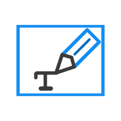
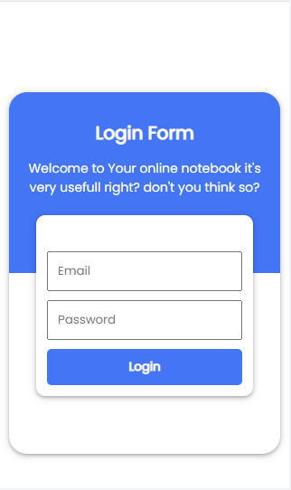

<br/>
<p align="center">
  <a href="https://github.com/dimasdh842/notes-reactjs">
    
  </a>

  <h3 align="center">K-notes</h3>

  <p align="center">
    An simple way to keep your notes built with React.js and firebase.
    <br/>
    <br/>
    <a href="https://github.com/dimasdh842/notes-reactjs"><strong>Explore the docs »</strong></a>
    <br/>
    <br/>
    <a href="https://keen-bhabha-ac145f.netlify.app/#/login">View Demo</a>
    .
    <a href="https://github.com/dimasdh842/notes-reactjs/issues">Report Bug</a>
    .
  </p>
</p>

    

## Table Of Contents

* [About the Project](#about-the-project)
* [Built With](#built-with)
* [Getting Started](#getting-started)
  * [Prerequisites](#prerequisites)
  * [Installation](#installation)
* [Roadmap](#roadmap)
* [Contributing](#contributing)
* [License](#license)
* [Authors](#authors)
* [Acknowledgements](#acknowledgements)

## About The Project



This app was created because I want to keep my idea in my notes but there are many platform offers too many feature so I built my own simple notes

## Built With

k-notes built with React.js and firebase 

## Getting Started

K-notes is simple project of React.js so the configuration mostly the same with configuration of react.js initial project

### Prerequisites

This project was bootstrapped with [Create React App](https://github.com/facebook/create-react-app).

## Available Scripts

In the project directory, you can run:

### `npm start`

Runs the app in the development mode.\
Open [http://localhost:3000](http://localhost:3000) to view it in the browser.

The page will reload if you make edits.\
You will also see any lint errors in the console.

### `npm test`

Launches the test runner in the interactive watch mode.\
See the section about [running tests](https://facebook.github.io/create-react-app/docs/running-tests) for more information.

### `npm run build`

Builds the app for production to the `build` folder.\
It correctly bundles React in production mode and optimizes the build for the best performance.

The build is minified and the filenames include the hashes.\
Your app is ready to be deployed!

See the section about [deployment](https://facebook.github.io/create-react-app/docs/deployment) for more information.

### `npm run eject`

**Note: this is a one-way operation. Once you `eject`, you can’t go back!**

If you aren’t satisfied with the build tool and configuration choices, you can `eject` at any time. This command will remove the single build dependency from your project.

Instead, it will copy all the configuration files and the transitive dependencies (webpack, Babel, ESLint, etc) right into your project so you have full control over them. All of the commands except `eject` will still work, but they will point to the copied scripts so you can tweak them. At this point you’re on your own.

You don’t have to ever use `eject`. The curated feature set is suitable for small and middle deployments, and you shouldn’t feel obligated to use this feature. However we understand that this tool wouldn’t be useful if you couldn’t customize it when you are ready for it.


### Installation

1. Clone the repo

```sh
git clone https://github.com/dimasdh842/K-Notes
```

3. Install NPM packages

```sh
npm install
```

4. Run the project

```sh
npm start
```

## Roadmap

See the [open issues](https://github.com/dimasdh842/notes-reactjs/issues) for a list of proposed features (and known issues).

## Contributing

Contributions are what make the open source community such an amazing place to be learn, inspire, and create. Any contributions you make are **greatly appreciated**.
* If you have suggestions for adding or removing projects, feel free to [open an issue](https://github.com/dimasdh842/notes-reactjs/issues/new) to discuss it, or directly create a pull request after you edit the *README.md* file with necessary changes.
* Please make sure you check your spelling and grammar.
* Create individual PR for each suggestion.
* Please also read through the [Code Of Conduct](https://github.com/dimasdh842/notes-reactjs/blob/main/CODE_OF_CONDUCT.md) before posting your first idea as well.

### Creating A Pull Request

1. Fork the Project
2. Create your Feature Branch (`git checkout -b feature/AmazingFeature`)
3. Commit your Changes (`git commit -m 'Add some AmazingFeature'`)
4. Push to the Branch (`git push origin feature/AmazingFeature`)
5. Open a Pull Request

## License

Distributed under the MIT License. See [LICENSE](https://github.com/dimasdh842/notes-reactjs/blob/main/LICENSE.md) for more information.

## Authors

* **Mohammad Firmansyah** - *Comp Science Student* - [Mohammad Firmansyah](https://github.com/dmasdh842/) - *Built initial project*

## Acknowledgements

* [Mohammad Firmansyah](https://github.com/dimasdh842)
* [Othneil Drew](https://github.com/othneildrew/Best-README-Template)
* [firmansmoh](https://mrrangga.github.io)
